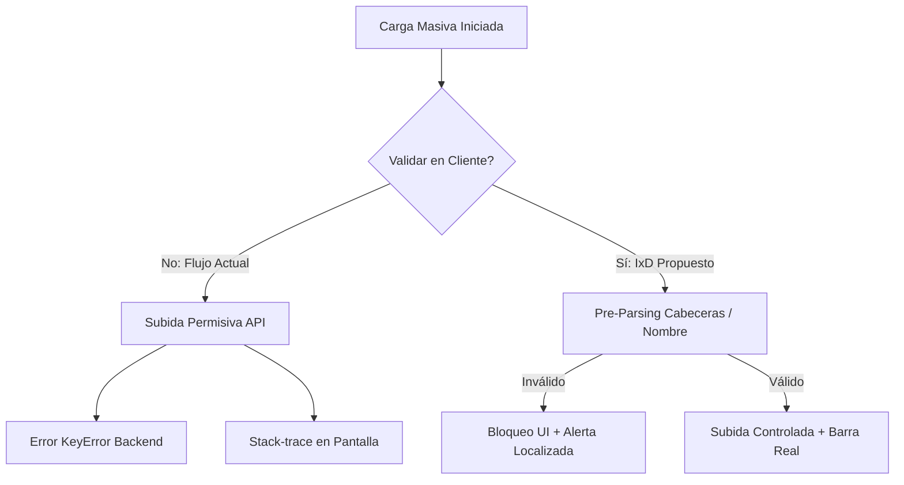

# AUDITORIA DE ACCESIBILIDAD Y EXPERIENCIA DE USUARIO (UX/UI) - ARBORTRUST

**Rol:** Diseñador de Interacción (IxD) Senior, Experto en UX/UI y Auditor de Accesibilidad Frontend.
**Documento:** Reporte de Evaluación de Interfaces y Control de Fricción
**Archivo Evaluado:** [Formulario.jsx](file:///c:/Users/Acer/Desktop/Estudio/Proyectos/ArborTrust/Arbor_trust/frontend/src/pages/Formulario.jsx)

---

## 1. PREVENCIÓN DE ERRORES HUMANOS (La causa raíz del incidente)

El análisis del flujo de carga masiva en [Formulario.jsx](file:///c:/Users/Acer/Desktop/Estudio/Proyectos/ArborTrust/Arbor_trust/frontend/src/pages/Formulario.jsx) revela una desconexión crítica entre la intención del usuario y la entrada de datos del sistema. La interfaz confía ciegamente en que el usuario realizará una selección perfecta de manera manual, sin controles preventivos automáticos en el cliente.

### Diagnósticos específicos:

- 🔴 **Falta de Validación de Coincidencia (Mismatch) entre Tipo de Datos y Archivo Seleccionado**
  * **Descripción de la falla:** La interfaz no realiza ninguna verificación en el lado del cliente (JavaScript) para comprobar si el nombre, extensión, o estructura inicial del archivo coincide con el tipo de datos seleccionado en el menú desplegable. Al procesar la subida múltiple en `handleFileUpload`, todos los archivos seleccionados en la UI se envían con el mismo `tipoArchivo` activo del dropdown, permitiendo que un archivo como `balances_sample.csv` sea procesado bajo el tipo `operaciones` (provocando un error `KeyError` del backend al buscar la columna `operacion_id`).
  * **Impacto en el usuario:** El regente forestal o el evaluador de OSINFOR experimenta una ruptura del flujo de trabajo al enviar archivos que el backend no puede interpretar. La aplicación acepta la carga pero genera un fallo en segundo plano, obligando al usuario a volver a seleccionar y cargar, aumentando la frustración y la desconfianza en la integridad del sistema.
  * **Líneas de código implicadas:** [Formulario.jsx#L129-L141](file:///c:/Users/Acer/Desktop/Estudio/Proyectos/ArborTrust/Arbor_trust/frontend/src/pages/Formulario.jsx#L129-L141) (donde se asigna el estado local `tipo` de forma uniforme) y [Formulario.jsx#L349-L395](file:///c:/Users/Acer/Desktop/Estudio/Proyectos/ArborTrust/Arbor_trust/frontend/src/pages/Formulario.jsx#L349-L395) (la estructura del formulario donde reside el select del tipo de archivo y el input file).

- 🔴 **Interfaz Altamente Permisiva con la Incongruencia de Datos**
  * **Descripción de la falla:** El botón de envío `<button type="submit">` y la función [handleFileUpload](file:///c:/Users/Acer/Desktop/Estudio/Proyectos/ArborTrust/Arbor_trust/frontend/src/pages/Formulario.jsx#L119-L176) se habilitan únicamente en función de si `selectedFiles.length > 0`. No existe un paso intermedio de confirmación, ni un pre-análisis de los encabezados del archivo para contrastar con las columnas mínimas del esquema correspondiente (ej. verificar la presencia de `arbol_id` para censo, o `operacion_id` para operaciones) antes de disparar las peticiones HTTP concurrentes.
  * **Impacto en el usuario:** Permite la inyección inmediata de archivos vacíos, archivos con nombres erróneos o estructuras corruptas, trasladando toda la responsabilidad de la validación al backend y congestionando la cola de procesamiento del servidor de manera innecesaria.
  * **Líneas de código implicadas:** [Formulario.jsx#L391-L393](file:///c:/Users/Acer/Desktop/Estudio/Proyectos/ArborTrust/Arbor_trust/frontend/src/pages/Formulario.jsx#L391-L393) (el botón submit no valida congruencia lógica) y [Formulario.jsx#L119-L128](file:///c:/Users/Acer/Desktop/Estudio/Proyectos/ArborTrust/Arbor_trust/frontend/src/pages/Formulario.jsx#L119-L128) (la lógica de verificación previa en el handler de carga).

---

## 2. CLARIDAD EN LOS MENSAJES DE ERROR (Heurística de Reconocimiento y Recuperación)

El manejo de excepciones y visualización de errores del backend es rudimentario y técnico. La interfaz delega la visualización del error a cadenas de texto crudas del servidor sin aplicar traducción conceptual.

### Diagnósticos específicos:

- 🔴 **Exposición de Excepciones Técnicas Crudas (Tech-Speak / Leak de Stack-trace)**
  * **Descripción de la falla:** En el renderizado de los trabajos con estado `FALLIDO`, la aplicación escribe directamente en pantalla el valor de `trabajo.resultado.error`. Si el backend arroja un error técnico de bajo nivel de Python o SQLite (como `KeyError: 'operacion_id'` o `UNIQUE constraint failed: operaciones.arbol_id`), este se muestra de forma literal al usuario final, sin mapearse a un mensaje semántico del dominio forestal.
  * **Impacto en el usuario:** Desorientación y pérdida de autonomía. El regente forestal no comprende la causa del error ("KeyError" o "UNIQUE constraint") ni sabe cómo solucionarlo (ej. "Este ID de árbol ya ha sido registrado en el censo" o "El archivo seleccionado carece del encabezado de operación obligatorio").
  * **Líneas de código implicadas:** [Formulario.jsx#L504-L511](file:///c:/Users/Acer/Desktop/Estudio/Proyectos/ArborTrust/Arbor_trust/frontend/src/pages/Formulario.jsx#L504-L511) (renderizado del bloque de error dentro de la tarjeta de progreso del trabajo).

- 🔴 **Ambigüedad en el Feedback de Carga Individual vs. Carga Masiva**
  * **Descripción de la falla:** El componente comparte estados de error globales (`error`) y locales (`trabajo.resultado.error`). En la pestaña de carga masiva, un error al iniciar las subidas puede sobreescribir o generar alertas confusas en el área inferior destinada exclusivamente a los errores del formulario individual, rompiendo la coherencia contextual de la pantalla.
  * **Impacto en el usuario:** Confusión de procedencia. El usuario puede ver alertas de "Error en el Proceso" en el pie de página de la pantalla y no entender si corresponde a un intento de carga individual o a una de las tarjetas del panel de procesamiento asíncrono.
  * **Líneas de código implicadas:** [Formulario.jsx#L520-L530](file:///c:/Users/Acer/Desktop/Estudio/Proyectos/ArborTrust/Arbor_trust/frontend/src/pages/Formulario.jsx#L520-L530) (el bloque condicional de renderizado del error global de la página que está acoplado a la pestaña individual).

---

## 3. RETROALIMENTACIÓN DEL ESTADO DEL SISTEMA (Visibilidad del Proceso Asíncrono)

La retroalimentación del progreso de las tareas asíncronas no es fidedigna y carece de interactividad. Si las tareas demoran por congestión o archivos masivos, el usuario queda atrapado en un estado de incertidumbre.

### Diagnósticos específicos:

- 🔴 **Barra de Progreso Estática y Hardcodeada en Estados de Espera y Procesamiento**
  * **Descripción de la falla:** El progreso visual de las tareas concurrentes se calcula de manera estática y fija en base al estado textual de la tarea: se asigna un valor rígido de `30` para el estado `EN_COLA` y `60` para el estado `PROCESANDO`. No existe un progreso porcentual real basado en filas leídas o bytes subidos, lo que simula una barra inanimada hasta que pasa abruptamente a `100` (COMPLETADO/FALLIDO).
  * **Impacto en el usuario:** Falsa percepción de congelamiento del sistema. Ante archivos grandes o alta concurrencia de usuarios en el servidor, ver una barra de progreso congelada en `60%` durante un tiempo prolongado incita al usuario a recargar la página web, cancelar el proceso de forma abrupta, o duplicar la subida del archivo.
  * **Líneas de código implicadas:** [Formulario.jsx#L101](file:///c:/Users/Acer/Desktop/Estudio/Proyectos/ArborTrust/Arbor_trust/frontend/src/pages/Formulario.jsx#L101) (donde se define la lógica condicional del porcentaje de progreso durante el short-polling) y [Formulario.jsx#L480-L489](file:///c:/Users/Acer/Desktop/Estudio/Proyectos/ArborTrust/Arbor_trust/frontend/src/pages/Formulario.jsx#L480-L489) (la renderización de la barra de progreso).

- 🔴 **Ausencia de Controles de Cancelación y Gestión de Cola Asíncrona**
  * **Descripción de la falla:** Una vez que un archivo ha sido subido e ingresa al estado `EN_COLA` o `PROCESANDO`, el usuario no dispone de ningún botón o control para cancelar la petición en el backend, ni para remover un trabajo fallido o completado del panel visual de subidas.
  * **Impacto en el usuario:** Falta de control sobre sus acciones. Si un usuario se percata de que subió un archivo incorrecto por error, no puede detener la ejecución y debe esperar a que el backend procese por completo la tarea, consumiendo recursos del servidor innecesariamente. Además, el panel se satura visualmente con registros antiguos de trabajos sin posibilidad de limpiarlos.
  * **Líneas de código implicadas:** [Formulario.jsx#L459-L478](file:///c:/Users/Acer/Desktop/Estudio/Proyectos/ArborTrust/Arbor_trust/frontend/src/pages/Formulario.jsx#L459-L478) (el contenedor de estado y badges dentro del panel, el cual carece de botones de interacción como cancelar, reintentar o descartar).

- 🔴 **Invisibilidad del Progreso de Subida de Red (Upload Network Progress)**
  * **Descripción de la falla:** Al iniciar la subida de un archivo a través de la función [api.cargarArchivo](file:///c:/Users/Acer/Desktop/Estudio/Proyectos/ArborTrust/Arbor_trust/frontend/src/pages/Formulario.jsx#L146), el estado se establece inmediatamente en `SUBIENDO` con un progreso del `10%`. No hay uso de manejadores de eventos como `onUploadProgress` (de Axios o XMLHttpRequest) para rastrear el flujo de red real del archivo hacia el servidor.
  * **Impacto en el usuario:** En conexiones lentas de campo (común en oficinas descentralizadas de OSINFOR), la subida de archivos pesados se siente "muerta" y sin actividad, ya que el `10%` se mantiene estático hasta que finaliza el POST.
  * **Líneas de código implicadas:** [Formulario.jsx#L134-L135](file:///c:/Users/Acer/Desktop/Estudio/Proyectos/ArborTrust/Arbor_trust/frontend/src/pages/Formulario.jsx#L134-L135) (valores fijos al inicializar) y [Formulario.jsx#L144-L173](file:///c:/Users/Acer/Desktop/Estudio/Proyectos/ArborTrust/Arbor_trust/frontend/src/pages/Formulario.jsx#L144-L173) (disparo asíncrono sin monitoreo de flujo de red).

---

## 4. CARGA COGNITIVA Y FRICCIÓN EN LA CARGA MASIVA

El flujo de trabajo actual obliga al usuario a memorizar formatos, carece de guías visuales y presenta rigideces de interacción en la manipulación de listas.

### Diagnósticos específicos:

- 🔴 **Inexistencia de Instrucciones de Formato y Enlaces de Descarga de Plantillas Oficiales**
  * **Descripción de la falla:** El dropdown de tipos de datos a cargar menciona nombres de archivos muestra (ej. `operaciones_sample.csv`, `arboles_sample.csv`), pero la interfaz no ofrece ningún enlace o botón de descarga para que el usuario pueda obtener una plantilla CSV oficial en blanco con los encabezados esperados por el sistema. Tampoco hay una sección de ayuda, tooltip o acordeón con la descripción de los campos requeridos por categoría.
  * **Impacto en el usuario:** Fricción extrema y dependencia de canales externos. El usuario debe buscar documentación externa, abrir archivos antiguos para copiar los encabezados, o adivinar las columnas correctas, lo que incrementa sustancialmente la probabilidad de que falle la carga.
  * **Líneas de código implicadas:** [Formulario.jsx#L353-L364](file:///c:/Users/Acer/Desktop/Estudio/Proyectos/ArborTrust/Arbor_trust/frontend/src/pages/Formulario.jsx#L353-L364) (el mapeo de opciones en el select que es meramente textual).

- 🔴 **Rigidez Absoluta y Falta de Descarte de Archivos en Selección Múltiple**
  * **Descripción de la falla:** El componente permite la selección múltiple de archivos a través del atributo `multiple` en el input. No obstante, al renderizar la lista de archivos elegidos (`selectedFiles`), se hace de forma estática en modo de solo lectura. No existe un control de descarte individual (como un botón con icono "x") al lado de cada archivo de la lista antes de presionar el botón "Cargar Archivos". Además, cualquier nueva interacción con el input reemplaza por completo la lista previa en vez de anexar elementos.
  * **Impacto en el usuario:** Si el usuario selecciona 5 archivos pesados y se da cuenta de que uno de ellos es incorrecto, no puede eliminarlo de forma individual; está forzado a reiniciar la selección de todo el lote de archivos, aumentando la fricción en la operación del sistema.
  * **Líneas de código implicadas:** [Formulario.jsx#L376-L383](file:///c:/Users/Acer/Desktop/Estudio/Proyectos/ArborTrust/Arbor_trust/frontend/src/pages/Formulario.jsx#L376-L383) (el renderizado estático de la lista de archivos seleccionados).

- 🔴 **Ocultamiento del Semáforo de Riesgo y Resultados de Lotes en Carga Masiva**
  * **Descripción de la falla:** A diferencia del flujo de registro individual (el cual muestra un desglose del semáforo de riesgo y un botón para acceder al pasaporte digital del lote al finalizar con éxito), el flujo de carga masiva únicamente renderiza el número total de registros procesados y un mensaje corto. La interfaz no expone de manera interactiva el resultado del semáforo para cada archivo procesado dentro del panel de subidas masivas, obligando al usuario a navegar a otras secciones o buscar en la base de datos de manera externa.
  * **Impacto en el usuario:** Interrupción del ciclo de análisis. El usuario debe salir de la pantalla para auditar si los registros cargados de forma masiva cayeron en estado de alerta (Semáforo Amarillo/Rojo), lo que anula la retroalimentación inmediata del control forestal.
  * **Líneas de código implicadas:** [Formulario.jsx#L491-L502](file:///c:/Users/Acer/Desktop/Estudio/Proyectos/ArborTrust/Arbor_trust/frontend/src/pages/Formulario.jsx#L491-L502) (el bloque que renderiza el estado completado para un trabajo masivo).

---

## 5. ACCESIBILIDAD FRONTEND (A11y) Y CRITERIOS WCAG 2.1

La interfaz presenta debilidades serias en cuanto a la navegación sin ratón, visibilidad de actualizaciones en pantalla de lectores de voz, y semántica HTML de elementos de estado.

### Diagnósticos específicos:

- 🔴 **Inexistencia de Regiones y Atributos de Transmisión Activa (Aria-live) en Tareas en Segundo Plano**
  * **Descripción de la falla:** El panel de procesamiento asíncrono mapea dinámicamente un arreglo de trabajos activos, actualizando sus estados y progresos mediante short-polling. No obstante, las tarjetas de progreso y los badges no cuentan con atributos como `aria-live="polite"` o `role="status"` que avisen de manera sonora a un lector de pantalla sobre las transiciones de estado de `EN_COLA` a `PROCESANDO` y finalmente a `COMPLETADO` o `FALLIDO`.
  * **Impacto en el usuario:** Exclusión total para usuarios con discapacidad visual o lectores de pantalla. Una persona ciega no sabrá si su archivo se está subiendo, si la carga falló, o si ya terminó, al no recibir notificaciones auditivas de la mutación de estados en tiempo real.
  * **Líneas de código implicadas:** [Formulario.jsx#L400-L405](file:///c:/Users/Acer/Desktop/Estudio/Proyectos/ArborTrust/Arbor_trust/frontend/src/pages/Formulario.jsx#L400-L405) (el contenedor del panel de subidas) y [Formulario.jsx#L439-L449](file:///c:/Users/Acer/Desktop/Estudio/Proyectos/ArborTrust/Arbor_trust/frontend/src/pages/Formulario.jsx#L439-L449) (el wrapper de cada tarjeta).

- 🔴 **Estructura Semántica Incorrecta en Barras de Progreso**
  * **Descripción de la falla:** Las barras de progreso de las cargas se implementan usando elementos genéricos `
` con anchos dinámicos basados en porcentajes. Estos contenedores no incorporan la semántica HTML5 estándar de accesibilidad (`role="progressbar"`, `aria-valuenow`, `aria-valuemin="0"`, `aria-valuemax="100"`).
  * **Impacto en el usuario:** Los lectores de pantalla leerán las barras de progreso simplemente como elementos visuales decorativos o contenedores vacíos, ocultando por completo el nivel de avance de la carga masiva al usuario asistido por tecnologías de accesibilidad.
  * **Líneas de código implicadas:** [Formulario.jsx#L480-L489](file:///c:/Users/Acer/Desktop/Estudio/Proyectos/ArborTrust/Arbor_trust/frontend/src/pages/Formulario.jsx#L480-L489) (donde se dibuja la barra de progreso del trabajo).

- 🔴 **Falta de Área de Carga Accesible por Teclado e Indicador Dropzone Visual**
  * **Descripción de la falla:** El elemento de selección de archivos es un input nativo oculto tras estilos genéricos, y no cuenta con un contenedor visual (Dropzone) accesible mediante foco por teclado (`tabindex="0"`) que permita interactuar mediante arrastre de archivos o que describa claramente a usuarios de teclado cómo invocar la subida.
  * **Impacto en el usuario:** Los usuarios con movilidad reducida que navegan únicamente con teclado se ven obligados a interactuar con un input file genérico con foco de baja visibilidad, dificultando su interacción con el sistema.
  * **Líneas de código implicadas:** [Formulario.jsx#L367-L375](file:///c:/Users/Acer/Desktop/Estudio/Proyectos/ArborTrust/Arbor_trust/frontend/src/pages/Formulario.jsx#L367-L375) (el elemento input de archivos).

---

## RESUMEN DE LA AUDITORÍA Y RECOMENDACIONES DE DISEÑO (IxD)

Para subsanar estas deficiencias de experiencia, se recomienda aplicar las siguientes correcciones de interacción y lógica frontend en una fase posterior:
1. **Validación de nombre y extensión en caliente:** Comprobar que el archivo coincida con la categoría seleccionada antes de permitir el submit.
2. **Pre-parsing local de cabeceras:** Leer las primeras líneas del archivo en el navegador para comprobar si contiene las columnas requeridas por el backend.
3. **Mapeo de errores semánticos:** Reemplazar el mensaje de error del backend por un mapeo de claves técnicas (como `KeyError`, `UNIQUE constraint failed`) a frases amigables en español orientadas al dominio forestal.
4. **Barras de progreso reales y dinámicas:** Reemplazar los porcentajes estáticos de `30%` y `60%` por un cálculo preciso del estado real y proveer un botón para cancelar/abortar peticiones.
5. **Enlaces de descarga de plantillas:** Incorporar enlaces `<a href="/templates/censo_format.csv" download>` para agilizar el onboarding de nuevos regentes forestales.
6. **Controles accesibles WCAG:** Incorporar `aria-live`, `role="progressbar"`, y un dropzone accesible con soporte de arrastre y soltado (drag-and-drop).
