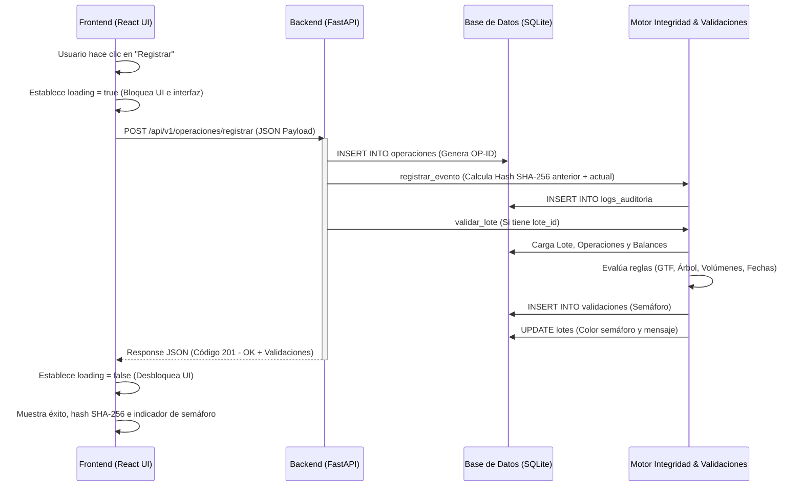

# DIAGNÓSTICO DE LA ARQUITECTURA ACTUAL

Este documento proporciona un análisis exhaustivo y detallado del estado técnico del repositorio de **ArborTrust**. El objetivo es servir como mapa de contexto definitivo para que un Arquitecto de Software diseñe e implemente un sistema robusto de concurrencia, tolerancia a fallos e idempotencia sobre lo que ya está construido.

---

### 1. Stack Tecnológico y Entorno de Ejecución

El sistema se compone de una arquitectura desacoplada con un backend en Python y un frontend en React (TypeScript/JavaScript). A continuación se detallan los componentes exactos identificados en la inspección:

#### Backend y Runtime
*   **Lenguaje:** Python (versión de compatibilidad 3.10+ implicada por el tipado moderno de unión `|` en firmas de funciones como `hash_anterior: str | None`).
*   **Framework API:** **FastAPI** en su versión `0.115.6` (definido en `requirements.txt`).
*   **Servidor ASGI/Ejecución:** **Uvicorn** en su versión `0.32.1` con la opción `[standard]`.
*   **Base de Datos Activa:** **SQLite** local de un solo archivo. La base de datos se guarda en `backend/arbortrust.db`.
*   **Librerías Clave Adicionales:**
    *   `pandas==2.2.3` (para lectura rápida de archivos planos y queries de validación SQL).
    *   `pydantic==2.10.3` (para serialización y validación de tipos del request).
    *   `python-multipart==0.0.20` (instalado en dependencias, aunque no se usa activamente en los endpoints actuales).
    *   `qrcode[pil]==8.0` y `Pillow==11.1.0` (para la generación y renderizado de códigos QR).

#### Frontend
*   **Herramienta de Construcción (Bundler):** **Vite** en su versión `8.0.12` (definido en `package.json`).
*   **Librería Principal:** **React** versión `19.2.6` y **React-DOM** versión `19.2.6`.
*   **Enrutador:** **React Router DOM** versión `7.17.0`.
*   **Iconografía:** **Lucide React** versión `1.18.0`.
*   **Estilos y Apariencia:** CSS Puro (Vanilla CSS) configurado en [index.css](file:///c:/Users/Acer/Desktop/Estudio/Proyectos/ArborTrust/Arbor_trust/frontend/src/index.css) y [App.css](file:///c:/Users/Acer/Desktop/Estudio/Proyectos/ArborTrust/Arbor_trust/frontend/src/App.css). El tema visual (oscuro/claro) se gestiona de manera dinámica modificando el atributo `data-theme` en la etiqueta de documento raíz de React y almacenando la preferencia en `localStorage`.

#### Entorno de Servidor y Contenedores
*   **Configuración Actual:** No se cuenta con configuraciones de contenedores (Docker/docker-compose) ni configuración para servidores web proxy invertidos (Nginx o Apache).
*   **Levantamiento local actual:**
    *   **Backend:** Se ejecuta mediante el comando `python -m uvicorn api.main:app --reload --port 8000`.
    *   **Frontend:** Se ejecuta mediante el servidor de desarrollo de Vite con `npm run dev`.

---

### 2. Mapeo de Endpoints y Flujo de Entrada de Archivos

#### Endpoints Disponibles en el API (`backend/api/main.py`)

1.  **Registro de Operación:**
    *   **Ruta:** `/api/v1/operaciones/registrar`
    *   **Método HTTP:** `POST`
    *   **Firma del Controlador:**
        ```python
        @app.post("/api/v1/operaciones/registrar", status_code=201)
        def registrar_operacion(payload: OperacionRequest):
        ```
    *   **Estructura del Request Payload (Pydantic Model):**
        ```python
        class OperacionRequest(BaseModel):
            tipo_operacion: str  # Debe ser 'Tala', 'Trozado', 'Despacho' o 'Transformacion'
            punto_cadena: int    # Puntos de la cadena (2 = Aprovechamiento, 3 = Transporte, 4 = CTP)
            arbol_id: Optional[str] = None
            troza_id: Optional[str] = None
            lote_id: Optional[str] = None
            parcela_corta: str
            especie: str
            volumen: float
            numero_gtf: Optional[str] = None
            actor_id: str
            tipo_actor: str = "Titular"
            fecha: str           # String (habitualmente formato YYYY-MM-DD)
            observacion: Optional[str] = None
        ```

2.  **Línea de Tiempo de Trazabilidad:**
    *   **Ruta:** `/api/v1/trazabilidad/timeline/{id_lote}`
    *   **Método HTTP:** `GET`
    *   **Firma del Controlador:**
        ```python
        @app.get("/api/v1/trazabilidad/timeline/{id_lote}", response_model=TrazabilidadTimelineResponse)
        def obtener_timeline(id_lote: str):
        ```

3.  **Reporte de Fallas/Alertas (Semáforo):**
    *   **Ruta:** `/api/v1/reportes/fallas`
    *   **Método HTTP:** `GET`
    *   **Firma del Controlador:**
        ```python
        @app.get("/api/v1/reportes/fallas")
        def obtener_fallas():
        ```

#### Flujo Actual de Subida de Archivos

> [!WARNING]
> **Deficiencia de Arquitectura:** El backend de producción actual **NO** posee endpoints HTTP dedicados para recibir archivos (ej. mediante peticiones `multipart/form-data`) correspondientes a Censo Forestal, Libro de Operaciones, o Guías de Transporte Forestal (GTF).

En lugar de endpoints de subida dinámicos, el flujo de ingesta de archivos opera de la siguiente manera:
1.  Los archivos CSV de muestra (`arboles_sample.csv`, `balances_sample.csv`, `lotes_sample.csv` y `operaciones_sample.csv`) se colocan manualmente en la ruta local `data/sample/`.
2.  La base de datos se inicializa y carga de forma inicial a través de una función de semilla local llamada `seed_from_csv()` ubicada en [database.py](file:///c:/Users/Acer/Desktop/Estudio/Proyectos/ArborTrust/Arbor_trust/backend/database.py).
3.  **Manejo de archivos al recibirlos:** La función carga el archivo completo en la memoria RAM del servidor utilizando `pd.read_csv(...)` de la librería Pandas. Posteriormente, itera sobre los registros de forma síncrona fila por fila e inserta los datos en SQLite con declaraciones SQL nativas utilizando el modificador `INSERT OR IGNORE`.

---

### 3. Anatomía y Lógica de los Scripts de Procesamiento (Parsing)

El procesamiento y parsing de datos se encuentra concentrado únicamente en el script [database.py](file:///c:/Users/Acer/Desktop/Estudio/Proyectos/ArborTrust/Arbor_trust/backend/database.py) a través de la función `seed_from_csv()`.

#### Firma de la Función de Ingesta
```python
def seed_from_csv() -> None:
    """
    Importa los datos de los CSVs de muestra a SQLite.
    Es idempotente: usa INSERT OR IGNORE para no duplicar.
    """
```

#### Detalles de Ejecución y Rendimiento

*   **Sincronismo / Bloqueo:** La función de parsing se ejecuta de manera 100% síncrona. Si esta función fuera expuesta en un endpoint del servidor web (actualmente no lo está, se corre por CLI), **bloquearía por completo el hilo principal de ejecución** de FastAPI y Uvicorn debido a que no utiliza concurrencia cooperativa (`async`/`await`) ni hilos/procesos secundarios.
*   **Consumo de Memoria:** Pandas carga **todo el archivo CSV en un DataFrame en memoria RAM** a la vez (`df = pd.read_csv(...)`).
    *   *Evaluación para MVP:* Apropiado para archivos pequeños (kilobytes).
    *   *Evaluación de Escalamiento:* Crítico. En un escenario productivo con censos nacionales o libros de operaciones masivos (gigabytes de datos), cargar todo el contenido a memoria podría agotar la memoria RAM del servidor (Out of Memory - OOM).
*   **Mecanismo de Inserción (Base de Datos):**
    *   La inserción se realiza **uno por uno (Row-by-Row)** iterando el DataFrame con un ciclo de Python (`for _, row in df.iterrows()`) y ejecutando de manera individual `conn.execute(...)`.
    *   *Ventaja parcial:* Todo se realiza bajo la misma conexión abierta y el commit definitivo ocurre al final del archivo (`conn.commit()`), agrupándolos en una transacción única lógica.
    *   *Desventaja principal:* La iteración row-by-row en Python tiene un sobrecosto muy elevado. No se utiliza procesamiento en lote nativo (`executemany` de sqlite3) ni la utilidad masiva de Pandas (`to_sql` con configuración de chunksize).

---

### 4. Diccionario de Tablas, Restricciones y Conexión a Base de Datos

#### Conexión y Gestión de Transacciones
La base de datos SQLite se gestiona mediante la función `get_connection()` en `backend/database.py`:

```python
def get_connection() -> sqlite3.Connection:
    """Devuelve una conexión SQLite con row_factory activado."""
    conn = sqlite3.connect(str(DB_PATH))
    conn.row_factory = sqlite3.Row          # Permite acceder a las columnas por nombre
    conn.execute("PRAGMA journal_mode=WAL") # Write-Ahead Logging para concurrencia de lectura/escritura
    conn.execute("PRAGMA foreign_keys=ON")  # Habilita la validación de llaves foráneas
    return conn
```

> [!NOTE]
> **Estado de Transacciones:**
> *   Las transacciones modificadoras se confirman llamando a `conn.commit()`.
> *   **Vulnerabilidad:** No existen capturas de excepción explícitas en el API que ejecuten `conn.rollback()`. Aunque SQLite hace rollback de transacciones inconclusas cuando la conexión se cierra, la ausencia de llamadas explícitas a `rollback()` en bloques `except` expone el sistema a inconsistencias temporales en ambientes multi-hilo o si se introduce pooling.

---

#### DDL de Tablas Clave

A continuación se detalla la estructura física real extraída del DDL del sistema:

##### A. Tabla de Censo (`arboles`)
Almacena la planificación oficial o censo de árboles autorizados.
```sql
CREATE TABLE IF NOT EXISTS arboles (
    arbol_id             TEXT PRIMARY KEY,
    titulo_habilitante_id TEXT NOT NULL,
    titular              TEXT NOT NULL,
    parcela_corta        TEXT NOT NULL,
    especie              TEXT NOT NULL,
    volumen_censado      REAL NOT NULL,
    estado               TEXT DEFAULT 'Autorizado',
    condicion            TEXT DEFAULT 'Aprovechable',
    created_at           TEXT DEFAULT (datetime('now'))
)
```

##### B. Tabla de Libro de Operaciones (`operaciones`)
Registra las acciones físicas sobre la madera (Tala, Trozado, Despacho, Transformación).
```sql
CREATE TABLE IF NOT EXISTS operaciones (
    operacion_id    TEXT PRIMARY KEY,
    tipo_operacion  TEXT NOT NULL CHECK(tipo_operacion IN ('Tala','Trozado','Despacho','Transformacion')),
    punto_cadena    INTEGER NOT NULL CHECK(punto_cadena IN (2,3,4)),
    arbol_id        TEXT REFERENCES arboles(arbol_id),
    troza_id        TEXT,
    lote_id         TEXT,
    parcela_corta   TEXT NOT NULL,
    especie         TEXT NOT NULL,
    volumen         REAL NOT NULL,
    numero_gtf      TEXT,
    actor_id        TEXT NOT NULL,
    fecha           TEXT NOT NULL,
    observacion     TEXT,
    estado_validacion TEXT DEFAULT 'Pendiente',
    created_at      TEXT DEFAULT (datetime('now')),
    FOREIGN KEY (lote_id) REFERENCES lotes(lote_id)
)
```

##### C. Tabla de Guías de Transporte Forestal / Lotes (`lotes`)
El sistema integra las GTF como parte de los lotes comerciales.
```sql
CREATE TABLE IF NOT EXISTS lotes (
    lote_id               TEXT PRIMARY KEY,
    numero_gtf            TEXT NOT NULL,
    titulo_habilitante_id TEXT NOT NULL,
    titular               TEXT NOT NULL,
    parcela_corta         TEXT NOT NULL,
    especie               TEXT NOT NULL,
    volumen_total         REAL NOT NULL,
    punto_origen          TEXT DEFAULT 'Bosque',
    punto_destino         TEXT DEFAULT 'CTP',
    estado_validacion     TEXT DEFAULT 'Pendiente',
    color_semaforo        TEXT DEFAULT 'Amarillo',
    mensaje_validacion    TEXT,
    fecha_creacion        TEXT DEFAULT (datetime('now')),
    created_at            TEXT DEFAULT (datetime('now'))
)
```

##### D. Tabla de Saldos y Alertas de Volumen (`balances_extraccion`)
Lleva el balance de cuánto volumen ha sido autorizado y movilizado en la parcela forestal.
```sql
CREATE TABLE IF NOT EXISTS balances_extraccion (
    balance_id            TEXT PRIMARY KEY,
    titulo_habilitante_id TEXT NOT NULL,
    parcela_corta         TEXT NOT NULL,
    especie               TEXT NOT NULL,
    volumen_autorizado    REAL NOT NULL,
    volumen_movilizado    REAL NOT NULL DEFAULT 0,
    saldo_disponible      REAL NOT NULL,
    estado_saldo          TEXT DEFAULT 'Positivo',
    updated_at            TEXT DEFAULT (datetime('now'))
)
```

##### E. Tabla de Validaciones de Reglas (`validaciones`)
```sql
CREATE TABLE IF NOT EXISTS validaciones (
    validacion_id   TEXT PRIMARY KEY,
    lote_id         TEXT NOT NULL REFERENCES lotes(lote_id),
    regla           TEXT NOT NULL,
    resultado       TEXT NOT NULL CHECK(resultado IN ('Aprobado','Rechazado','Advertencia')),
    severidad       TEXT NOT NULL CHECK(severidad IN ('Baja','Media','Alta','Critica')),
    color_semaforo  TEXT NOT NULL CHECK(color_semaforo IN ('Verde','Amarillo','Rojo')),
    mensaje         TEXT NOT NULL,
    detalle_json    TEXT,            -- Datos adicionales de la falla en formato JSON serializado
    fecha_validacion TEXT DEFAULT (datetime('now'))
)
```

##### F. Tabla de Pasaportes Digitales (`pasaportes`)
```sql
CREATE TABLE IF NOT EXISTS pasaportes (
    pasaporte_id    TEXT PRIMARY KEY,
    lote_id         TEXT NOT NULL REFERENCES lotes(lote_id),
    numero_gtf      TEXT NOT NULL,
    estado          TEXT DEFAULT 'Activo',
    qr_url          TEXT,
    hash_integridad TEXT NOT NULL,
    fecha_generacion TEXT DEFAULT (datetime('now')),
    created_at      TEXT DEFAULT (datetime('now'))
)
```

##### G. Tabla de Bitácora de Integridad (`logs_auditoria`)
```sql
CREATE TABLE IF NOT EXISTS logs_auditoria (
    evento_id       TEXT PRIMARY KEY,
    timestamp       TEXT NOT NULL DEFAULT (datetime('now','utc')),
    actor_id        TEXT NOT NULL,
    tipo_actor      TEXT NOT NULL CHECK(tipo_actor IN ('Titular','Regente','ARFFS','SERFOR','OSINFOR','Transportista','Operador_CTP','Sistema','Comprador')),
    accion          TEXT NOT NULL,
    punto_cadena    INTEGER NOT NULL CHECK(punto_cadena IN (1,2,3,4)),
    entidad_tipo    TEXT NOT NULL,   -- 'Operacion', 'Lote', 'Transformacion', 'Pasaporte'
    entidad_id      TEXT NOT NULL,
    hash_anterior   TEXT,            -- NULL para el bloque génesis de la cadena de esa entidad
    hash_actual     TEXT NOT NULL,   -- SHA-256 generado deterministicamente
    payload_json    TEXT NOT NULL,   -- Datos serializados del evento
    ip_origen       TEXT,
    es_valido       INTEGER DEFAULT 1  -- 1=Válido, 0=Integridad rota
)
```

---

#### Índices de Rendimiento Vigentes
El sistema cuenta con los siguientes índices creados para mejorar las lecturas:
```sql
CREATE INDEX IF NOT EXISTS idx_operaciones_lote     ON operaciones(lote_id);
CREATE INDEX IF NOT EXISTS idx_operaciones_arbol    ON operaciones(arbol_id);
CREATE INDEX IF NOT EXISTS idx_logs_entidad         ON logs_auditoria(entidad_id);
CREATE INDEX IF NOT EXISTS idx_logs_timestamp       ON logs_auditoria(timestamp);
CREATE INDEX IF NOT EXISTS idx_validaciones_lote    ON validaciones(lote_id);
CREATE INDEX IF NOT EXISTS idx_validaciones_color   ON validaciones(color_semaforo);
```

#### Mapeo de ORM e Idempotencia

*   **Uso de ORM:** **Ninguno**. El código utiliza consultas SQL puras (Raw SQL) de forma nativa. Las conexiones se crean bajo demanda mediante la librería base `sqlite3` y se gestionan manualmente.
*   **Problema de Duplicación e Idempotencia:**
    *   No existen llaves primarias compuestas ni restricciones de unicidad (`UNIQUE`) en columnas lógicas clave fuera de las llaves primarias autogeneradas basadas en UUIDs (ej. `op_id = f"OP-{uuid.uuid4().hex[:8].upper()}"`).
    *   *Consecuencia:* Si un cliente envía el mismo request POST dos veces consecutivas debido a un reintento de conexión (red inestable, doble submit, etc.), el sistema generará dos UUIDs de operación distintos e insertará **ambos registros duplicados** en la base de datos sin levantar ninguna alerta o violación de integridad. Esto distorsiona por completo las sumas de volumen y los balances de extracción acumulativos.

---

### 5. Acoplamiento Frontend-Backend actual

El sistema presenta un acoplamiento **altamente síncrono y bloqueante** entre el Frontend (React) y el Backend (FastAPI).



#### Análisis del Comportamiento en la Carga de Archivos / Formularios

1.  **Bloqueo de Interfaz (UX):**
    En [Formulario.jsx](file:///c:/Users/Acer/Desktop/Estudio/Proyectos/ArborTrust/Arbor_trust/frontend/src/pages/Formulario.jsx#L45-L68), cuando el usuario envía una transacción mediante el botón "Registrar y Validar":
    *   La variable de estado React `loading` se define en `true`.
    *   El botón cambia visualmente a "Validando y registrando..." y se deshabilita (`disabled={loading}`), impidiendo que el usuario envíe peticiones secundarias o navegue fácilmente.
    *   La interfaz del usuario queda congelada esperando a que finalice **toda** la secuencia del backend.

2.  **Lógica Bloqueante en Backend:**
    FastAPI no delega el cálculo a una cola asíncrona de tareas (como Celery, RQ o BackgroundTasks nativos de FastAPI). En su lugar, ejecuta todo dentro de la misma petición HTTP:
    *   Inserta el registro de operación de manera síncrona.
    *   Calcula el hash criptográfico del bloque para la bitácora de auditoría (operación intensiva en CPU).
    *   Registra el log en base de datos.
    *   Ejecuta el motor de validación `validar_lote()` que realiza múltiples consultas a la base de datos para cargar las operaciones previas, verificar consistencias y computar el saldo.
    *   Actualiza el lote con el color del semáforo.
    *   Solo entonces, retorna el JSON final.

3.  **Riesgo de Escalabilidad:**
    Si el volumen de datos en la base de datos SQLite crece, las consultas en el motor de validaciones tardarán más tiempo. Al ser un proceso bloqueante, las peticiones HTTP demorarán, la interfaz del frontend experimentará lags significativos y podría causar interrupciones por tiempo de espera (Gateway Timeout) al procesar registros concurrentes.
